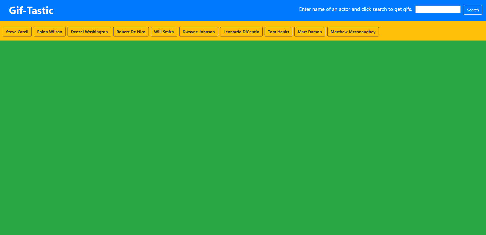
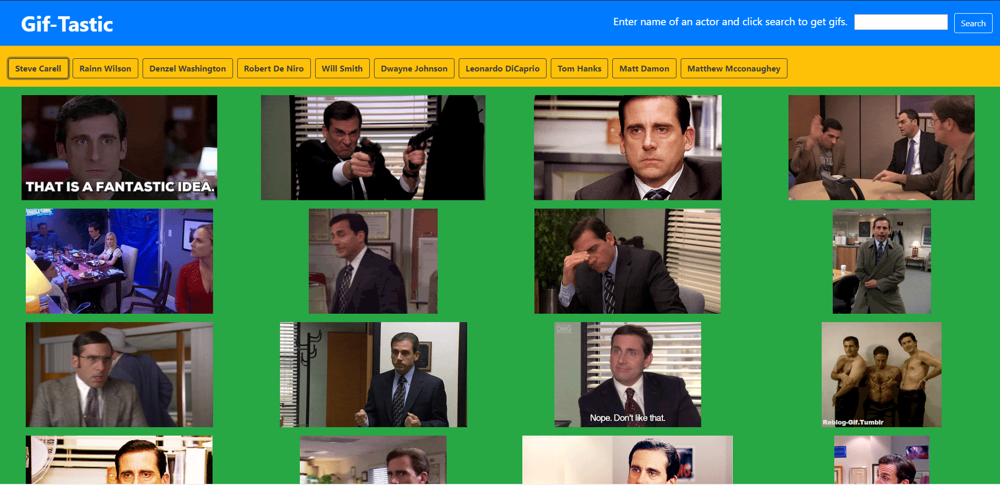
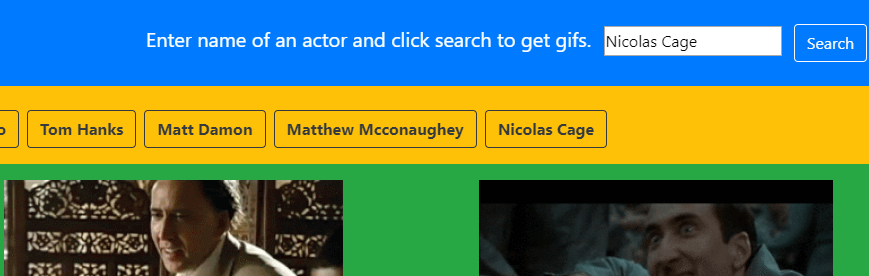

# Gif-Tastic

### Link: https://mpj1693.github.io/GifTastic/

### Overview

In this webpage you can search for gifs.
There are already some buttons with names of some actors, but you can create more.
Once the search term is submitted, a button with that string will be created without the page being reloaded.
On clicking that button, twenty-five still images of the corresponding term will be displayed.
On clicking any image it will animate and clicking again will stop the animation and make it a still image.
All this will happen without the page being reloaded.

### Languages

* Javascript
* HTML
* CSS
*JQuery

### Explaination

* This is the home page

* On clicking the button "Steve Carell", 25 still images of or related to Steve Carell appears. On clicking an image, it will animate.

* By entering "Nicolas Cage", a new button is created. And on clicking that button images realted to Nicolas Cage are displayed

* Everything until now happened without reloading the page. If the page is manually reloaded, the new buttons that are created will be deleted.

### Author

Manav Patel
